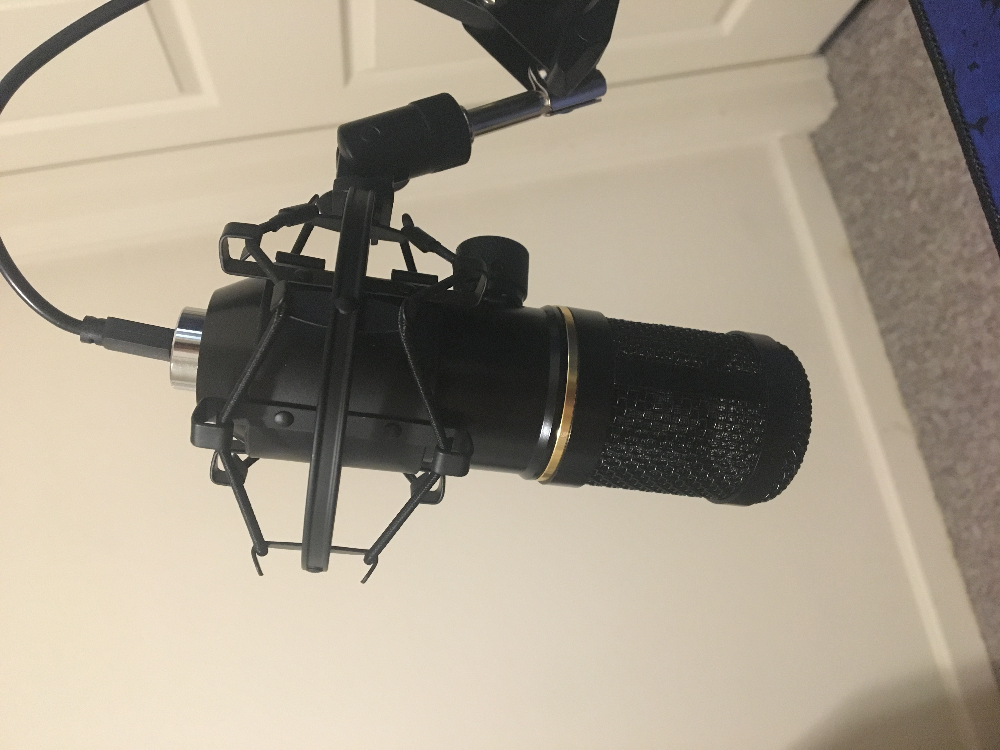
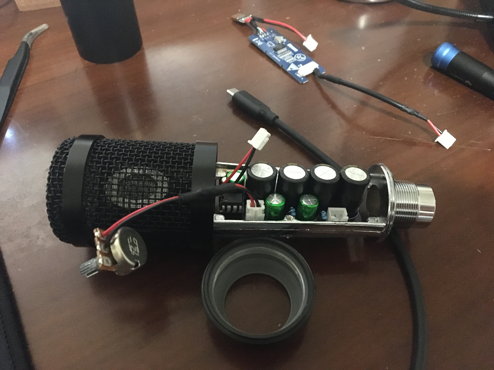
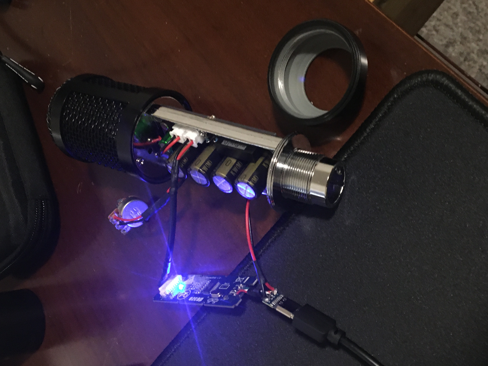

# diy-microphone

This project contributes a KiCad PCB design that implements the circuit described in the DIY Perks Microphone Project v1, https://www.youtube.com/watch?v=LoQu3XXIayc.

The PCB is designed to fit the internal form factor of the body of BM-800 XLR microphone. The BM-800 is an inexpensive microphone with a metal housing. The limited interior space of the microphone housing necessitates a dense PCB layout.

The XLR plug is replaced with a USB C female connector and a 3d printed mount is used to secure it. The SolidWorks part file and the .STL have been included as part of this repository. Additionally this 3d printable mount is used to hold the mic capsole, https://www.thingiverse.com/thing:2541735. I used a 1k reverse log potentiometer for volume control. It works and sounds great! Here are some pictures.

  
  
  
   

Matt (DIY Perks) has created extensive documentation for the DIY Perks Microphone Project v1 in the form of a youtube video, https://www.youtube.com/watch?v=LoQu3XXIayc. More information related to his project can be found here, https://diyperks.com/project_31_high-quality-usb-c-microphone/.
